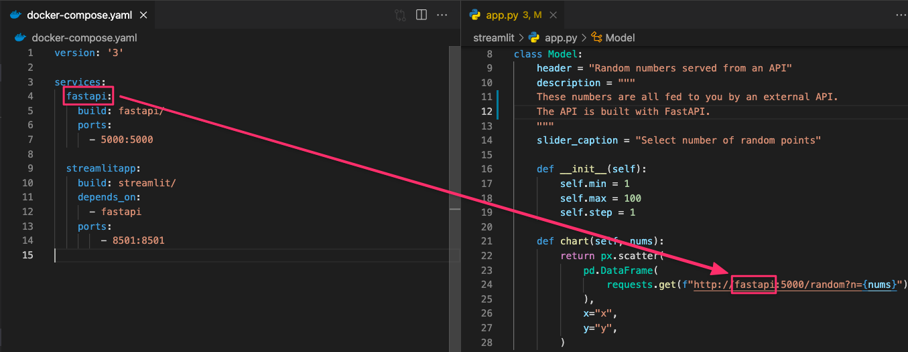

# Multi-container Docker app (Streamlit app + FastAPI app)

-   [Description](#description)
-   [Quick start](#quick-start)
-   [Walk through](#walk-through)
    -   [File structure](#file-structure)
    -   [Apps](#apps)
        -   [FastAPI app](#fastapi-app)
        -   [Streamlit app](#streamlit-app)
        -   [Multi-container Docker app](#multi-container-docker-app)
-   [Issues and Feature Request](#issues-and-feature-request)

## Description

Okay, so you have built an amazing model, wrapped it in a well-designed FastAPI app and neatly containerized it as a Docker image. How do you showcase it for your boss / colleague / customer / mom? Sure you get Swagger out of the box with FastAPI but is that enough? Wouldn't it be sexier to show some visualisations? Enter Streamlit.

Streamlit is _"the fastest way to build and share data apps"_ and you should take advantage of this light-weight tool to showcase your work.

This repository is a toy example on how to make a standalone Streamlit app communicate with a standalone FastAPI app.

## Quick start

Spin it all up

```sh
docker compose up
```

In your browser, attend [127.0.0.1:8501](http://127.0.0.1:8501/) and see the Streamlit app alive. Go to [127.0.0.1:5000/docs](http://127.0.0.1:5000/docs/) to see the Swagger documentation for the FastAPI app.

To bring it all down

```sh
docker compose down
```

## Walk through

### File structure

Besides git related and media stuff, the repository consist of 2 directories and 10 files (2 hidden, 8 visible):

```sh
.
├── README.md
├── docker-compose.yaml
├── fastapi
│   ├── .dockerignore
│   ├── Dockerfile
│   ├── app.py
│   └── requirements.txt
└── streamlit
    ├── .dockerignore
    ├── Dockerfile
    ├── app.py
    └── requirements.txt
```

### Apps

The repository consist of two apps: FastAPI and Streamlit.

#### FastAPI app

The FastAPI app is located in the directory `fastapi`:

```sh
fastapi
├── .dockerignore
├── Dockerfile
├── app.py
└── requirements.txt
```

The FastAPI app just expose one endpoint `GET /random?n=`, which provide `n` random numbers to a scatter plot. It's containerized through `Dockerfile` and `.dockerignore` makes sure, that only needed files are considered in the build proces. The needed libraries are listed in `requirements.txt`.

#### Streamlit app

The Streamlit app is located in the directory `streamlit`:

```sh
streamlit
├── .dockerignore
├── Dockerfile
├── app.py
└── requirements.txt
```

The Streamlit app is just a basic scatter plot and a slider to choose how many random numbers should be generated. It's containerized through `Dockerfile` and `.dockerignore` makes sure, that only needed files are considered in the build proces. The needed libraries are listed in `requirements.txt`.

#### Multi-container Docker app

The `docker-compose.yaml` takes care of defining and running the multi-container Docker app:

```yaml
version: "3"

services:
    fastapi:
        build: fastapi/
        ports:
            - 5000:5000

    streamlitapp:
        build: streamlit/
        depends_on:
            - fastapi
        ports:
            - 8501:8501
```

This is the absolute minimum definitions needed to build the multi-container app.

It would be good practice to explicitly state a network name, making the containers able to communicate with each other, but Docker compose automatically create a default network, making another network superfluous.

The _service name_ for the FastAPI app is the host name needed in the `requests.get()` method in `streamlit/app.py`:



## Issues and Feature Request

Any help or feedback are very welcome! 👋🏼

-   https://github.com/VildMedPap/dockerized_streamlit_app/issues
